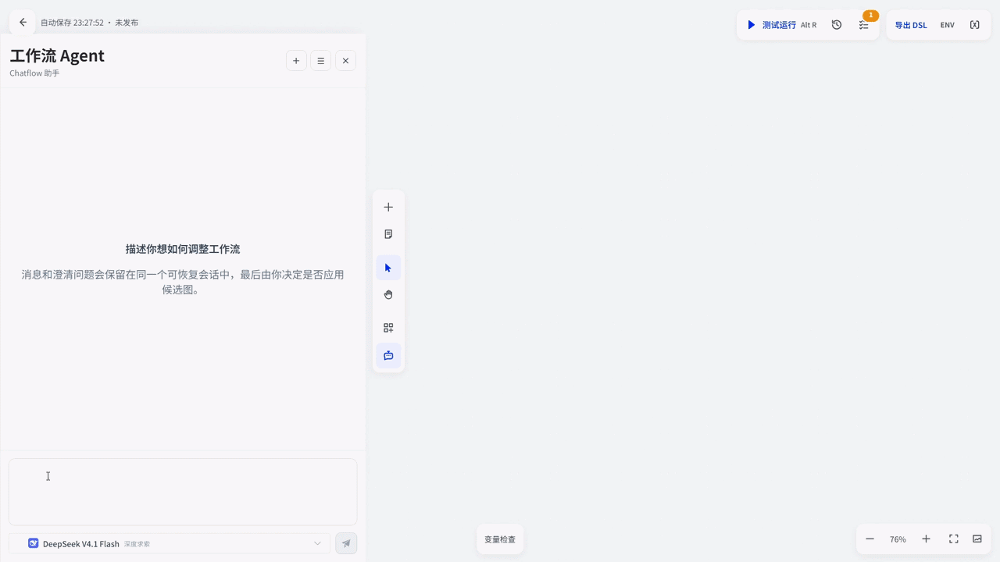
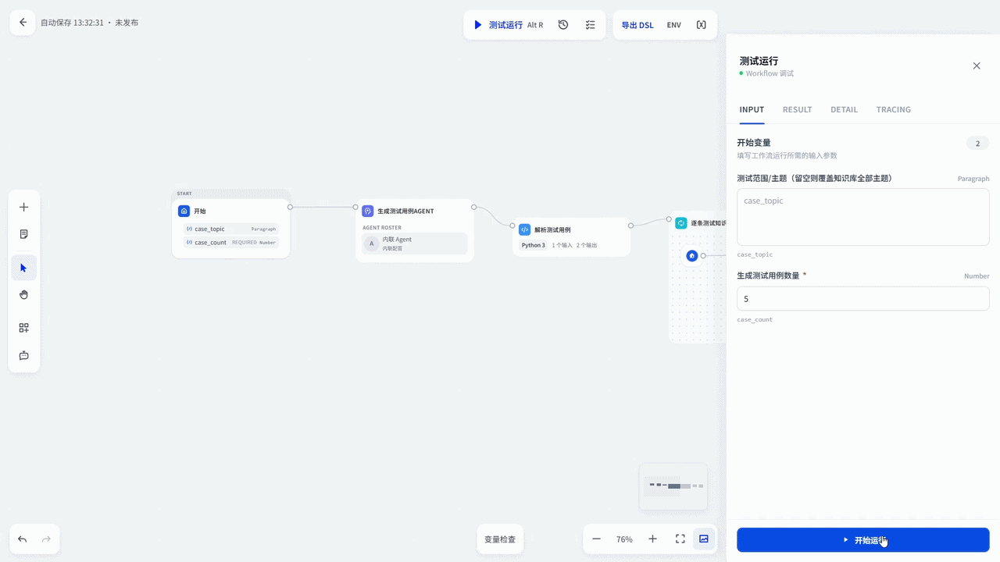
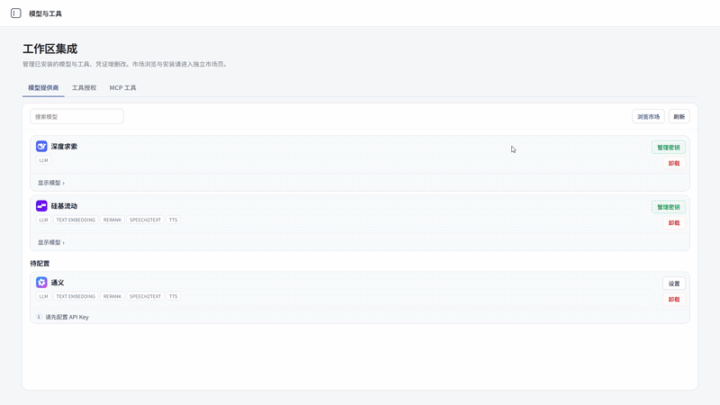
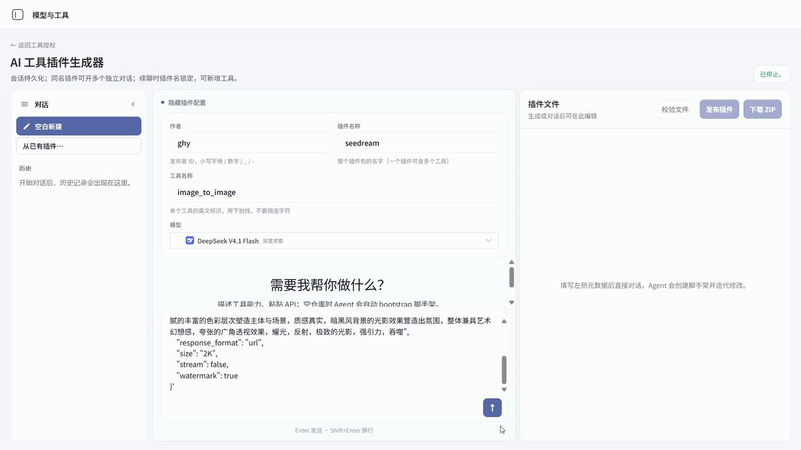
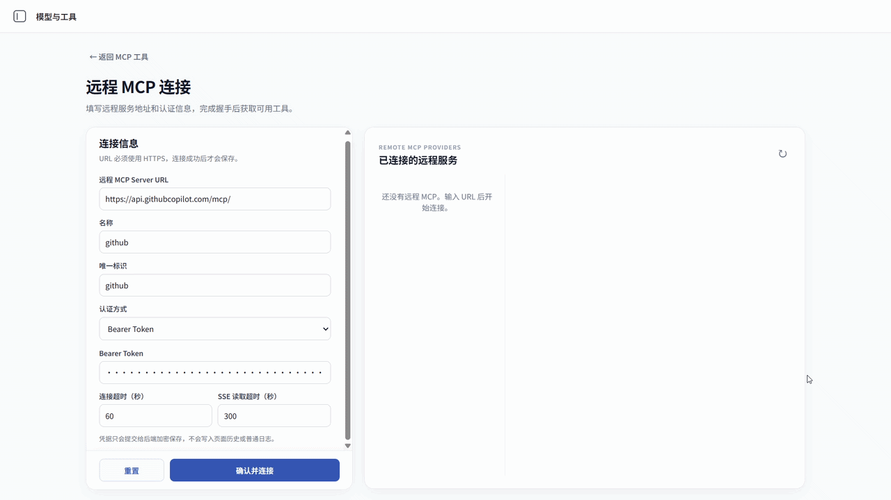
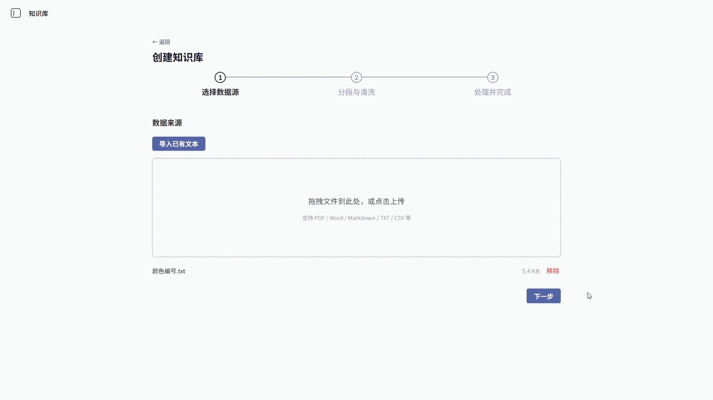

# AgentFlow

> A visual AI Agent workflow platform for building LLM, RAG, MCP and tool-calling applications.

AgentFlow 是一个面向 AI 应用开发的可视化 Agent 工作流平台，支持工作流编排、LLM、RAG、MCP 工具接入、Tool Calling 与流式 Agent 执行。

基于 Vue 3 + Python 构建，项目聚焦于 AI Agent 工作流的可视化编排、工具调用与运行过程展示。

## Core Features

- **Agent Workflow Generation** — 用自然语言描述需求，由 Agent 多轮调用工具生成、修改并校验工作流

  

- **Workflow Execution** — 在画布上运行工作流，查看节点执行过程与输出

  

- **Model & Tool Marketplace** — 接入大模型，并在工具插件市场浏览和安装插件

  

- **AI Tool Plugin Generation** — 由 AI 生成、校验并发布自定义工具插件

  

- **MCP Integration** — 连接 MCP Server，把外部工具接入工作流

  

- **RAG Knowledge Base** — 创建知识库、导入文档并构建可检索的数据

  


### Architecture

AgentFlow 采用前后端分离架构，并通过 Agent Runtime、数据库、缓存和向量数据库提供 AI Workflow 的运行能力。

```text
┌─────────────────────────────────────────────┐
│                Web Browser                  │
└─────────────────────┬───────────────────────┘
                      │
                      ▼
┌─────────────────────────────────────────────┐
│          Vue 3 / Vite Frontend              │
│                                             │
│  Workflow Editor · Dataset · MCP · Assist   │
└─────────────────────┬───────────────────────┘
                      │ REST / SSE
                      ▼
┌─────────────────────────────────────────────┐
│              Python API                     │
│                                             │
│ Workflow · Agent · Dataset · MCP · Tools    │
└───────────────┬─────────────────────────────┘
                │
                ▼
┌─────────────────────────────────────────────┐
│              Agent Runtime                  │
│                                             │
│        LLM · Tool Calling · MCP             │
└───────────────┬─────────────────────────────┘
                │
        ┌───────┼────────┐
        ▼       ▼        ▼
   PostgreSQL  Redis   Vector DB
```


### Tech Stack


| Layer          | Directory              | Technologies                                                |
| -------------- | ---------------------- | ----------------------------------------------------------- |
| Frontend       | `agent-flow-frontend/` | Vue 3, Vite, Pinia, Vue Router, Vue Flow, Element Plus      |
| Backend API    | `api/`                 | Python 3.12, Flask, Celery, SQLAlchemy, Pydantic, uv        |
| Agent SDK      | `dify-agent/`          | Python, Pydantic AI, HTTPX                                  |
| Agent Runtime  | `dify-agent-runtime/`  | Go                                                          |
| Infrastructure | `docker/`              | Docker Compose, PostgreSQL, Redis, Sandbox, Vector Database |


## Project Structure

```text
AgentFlow/
├── agent-flow-frontend/   # Vue 3 / Vite 工作流前端
├── api/                   # Python API 与工作流服务
├── dify-agent/            # Agent Python SDK 与服务
├── dify-agent-runtime/    # Go Agent Runtime
├── docker/                # Docker Compose 与本地开发环境
└── docs/                  # 项目文档与功能截图
```


## Requirements

- Node.js 22 与 npm
- Python 3.12
- Docker Desktop 与 Docker Compose


## Quick Start


### 1. Prepare the environment

在项目根目录生成本地环境配置：

```bash
python docker/prepare_dev_env.py
```


### 2. Start the backend

```bash
docker compose -f docker/docker-compose.yaml -f docker/docker-compose.local.yaml up -d --build
```


### 3. Start the frontend

在另一个终端运行：

```bash
cd agent-flow-frontend
npm ci
npm run dev
```

浏览器访问 [http://localhost:5173/agentFlow/](http://localhost:5173/agentFlow/)。

## Project Status

AgentFlow 当前处于持续开发阶段，适合用于 AI Agent 工作流、MCP 工具集成、RAG 和 Tool Calling 的学习、开发与功能验证。用于生产环境前，请根据实际场景完成安全、权限、数据备份和部署配置。

## Acknowledgements

AgentFlow 基于 [Dify](https://github.com/langgenius/dify) 的开源能力进行裁剪和扩展，感谢 Dify 及其社区提供的基础能力。

## License

本仓库包含来自 Dify 的开源代码，并遵循 [LICENSE](LICENSE) 中列出的许可证及附加条件。使用、修改或重新分发本项目之前，请完整阅读相关条款。