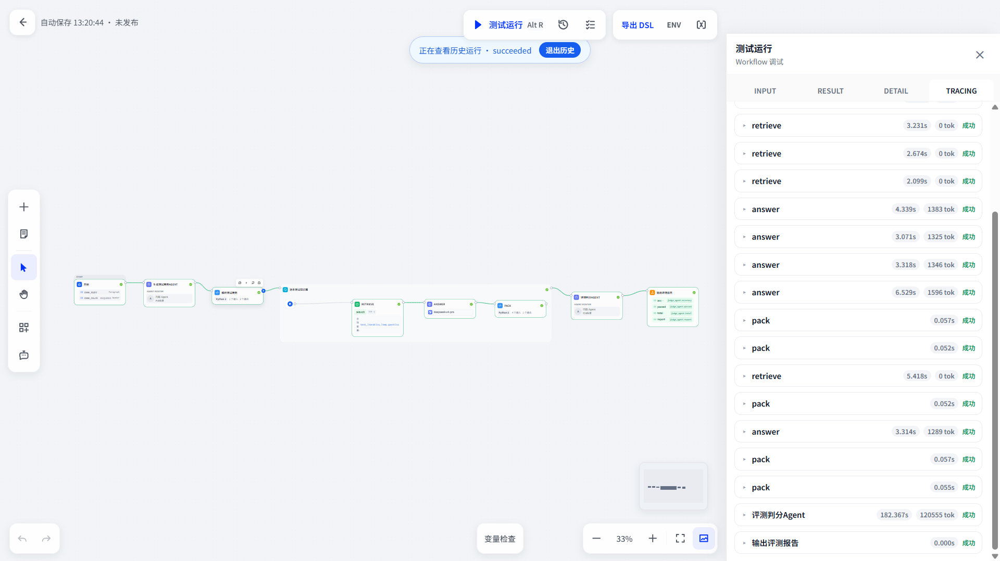
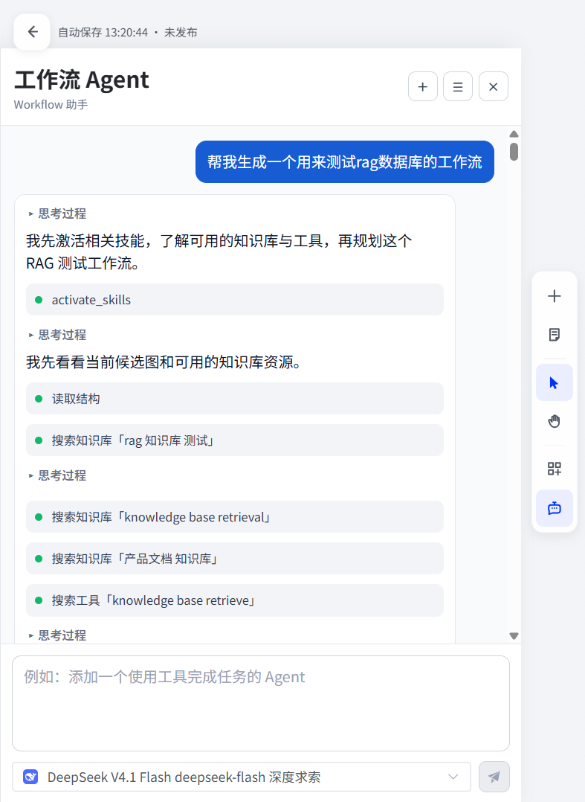
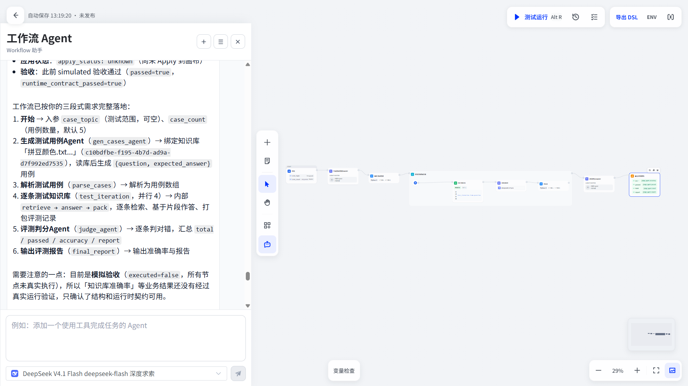
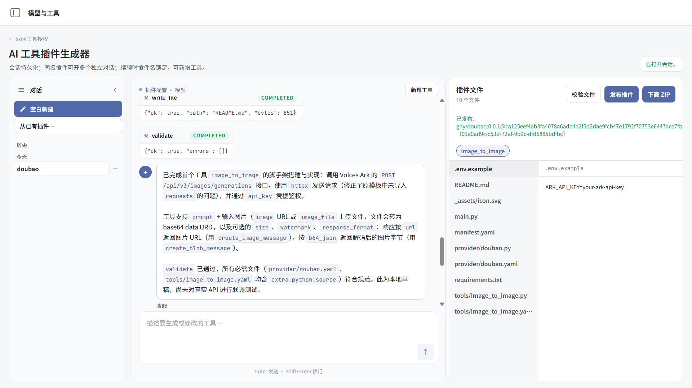

# AgentFlow

AgentFlow是一个面向 AI 应用团队的工作流构建与集成展示项目。它以 Dify 的 API、Agent 运行时和 Docker 配置为基础，配合独立的 Vue/Vite 管理前端，聚焦可视化工作流、流式 Workflow Assist、MCP 工具接入、AI 辅助工具插件生成与数据集管理。

**English summary:** AgentFlow is a curated Dify-based showcase for building AI workflows, streaming workflow assistance, MCP integrations, AI-assisted tool-plugin generation, and dataset operations. It is a source snapshot for development and evaluation, not a packaged production release.

## 功能亮点

- 工作流画布：基于 Vue Flow 的画布、节点注册、运行时状态和 DSL 处理，覆盖 LLM、代码、知识库、工具、循环、条件与触发器等工作流节点。

  

- 流式 Workflow Assist：前端包含 assist 状态机、SSE 消息处理、会话和运行事件展示；API 提供工作流协助会话、运行协调与持久化实现。

  

  

- MCP 集成：包含 MCP 客户端、工具提供方管理、OAuth 回调以及远程 MCP 助手界面。

- AI 工具插件生成：提供生成、校验、会话、流式 agent turn、发布、卸载和测试授权的 API 与前端工作区。

  

- 数据集：包含创建向导、文档、检索命中测试、数据管道、外部知识库连接和访问配置界面。

## 架构与技术栈

| 层级 | 目录 | 技术 |
| --- | --- | --- |
| 控制台前端 | `agent-flow-frontend/` | Vue 3、Vite、Pinia、Vue Router、Vue Flow、Element Plus |
| 应用 API | `api/` | Python 3.12、Flask、Celery、SQLAlchemy、Pydantic、uv |
| Agent SDK/服务 | `dify-agent/` | Python、Pydantic AI、HTTPX |
| Agent 运行时 | `dify-agent-runtime/` | Go |
| 本地基础设施 | `docker/` | Docker Compose、PostgreSQL、Redis、沙箱、SSRF 代理与可选向量库 |

## 精选目录

```text
.
├── agent-flow-frontend/  # 独立的 Vue/Vite 工作流控制台
├── api/                  # Dify API 与迁移
├── dify-agent/           # Agent Python SDK/服务
├── dify-agent-runtime/   # Go 运行时
├── docker/               # 后端依赖、源码构建覆盖与环境准备工具
└── docs/
    ├── design-system.md
    └── screenshots/      # README 功能截图
```

这是一个有意裁剪的仓库：未包含未修改的上游 `web/`、`packages/`、`cli/`、`sdks/`、`chatbot/` 和 `e2e/` 模块，也不包含测试套件、依赖、构建产物、运行时数据或本机凭据。

## 前置条件

- Node.js 22（参见 `.nvmrc`）与 npm
- Python 3.12
- [uv](https://docs.astral.sh/uv/)
- Go 1.26（构建 `dify-agent-runtime/` 时需要）
- Docker Desktop / Docker Compose（用于依赖服务和 Compose 配置校验）

## 快速启动（使用当前仓库源码）

下面的流程会用 Docker 启动 PostgreSQL、Redis、Weaviate、Sandbox、Plugin Daemon、Agent Backend，以及从当前仓库构建的 API 和 Celery Worker；自定义 Vue 前端在宿主机运行。第一次构建和拉取镜像可能需要较长时间。

### 1. 生成本地环境配置

在仓库根目录执行：

```bash
python docker/prepare_dev_env.py
```

该命令基于 `docker/.env.example` 创建 `docker/.env`，为所有 `CHANGE_ME_*` 生成随机值，并确保服务间必须一致的密钥使用同一个值。为保护已有配置，目标文件存在时命令会拒绝覆盖。

### 2. 启动后端和依赖

仍在仓库根目录执行：

下面这一行可直接用于 Windows PowerShell、CMD、Bash 和 zsh：

```text
docker compose -f docker/docker-compose.yaml -f docker/docker-compose.local.yaml up -d --build db_postgres redis weaviate sandbox local_sandbox plugin_daemon agent_backend ssrf_proxy api worker
```

`docker/docker-compose.local.yaml` 会从本仓库构建 `api`、`worker`、`dify-agent` 和 `dify-agent-runtime`。对应的本地镜像是 `agentflow-api:local`、`agentflow-agent-backend:local` 和 `agentflow-agent-runtime:local`，因此运行的是当前修改后的后端源码，而不是 Compose 中这几个服务默认的官方镜像。

查看容器状态并检查 API：

```bash
docker compose -f docker/docker-compose.yaml -f docker/docker-compose.local.yaml ps
curl http://localhost:5001/health
```

PowerShell 可用以下命令检查 API：

```powershell
Invoke-RestMethod http://localhost:5001/health
```

### 3. 启动前端

另开一个终端：

```bash
cd agent-flow-frontend
cp .env.example .env
npm ci
npm run dev
```

Windows PowerShell 中复制环境文件使用：

```powershell
Set-Location agent-flow-frontend
Copy-Item .env.example .env
npm ci
npm run dev
```

浏览器打开 [http://localhost:5173/agentFlow/](http://localhost:5173/agentFlow/)。前端会把 `/console/api` 请求代理到 `http://localhost:5001`。

### 4. 停止项目

先在前端终端按 `Ctrl+C`，再从仓库根目录停止后端容器：

```bash
docker compose -f docker/docker-compose.yaml -f docker/docker-compose.local.yaml down
```

数据库和上传数据保存在被 Git 忽略的 `docker/volumes/` 中，普通 `down` 不会删除这些数据。

### 不使用 Docker 运行 API

如需在宿主机直接调试 Python API，请按 [api/README.md](api/README.md) 配置 PostgreSQL、Redis、Sandbox、Plugin Daemon 和 Agent Backend，再使用 `uv run --directory api ...` 启动。不要只执行完整的默认 Compose 后就认为它运行了本地后端源码；默认 `api` 服务使用固定的上游镜像。

| 文件 | 用途 | 可提交 |
| --- | --- | --- |
| `agent-flow-frontend/.env.example` | 前端 API 地址示例 | 是 |
| `api/.env.example` | API 配置模板 | 是 |
| `docker/.env.example` | Compose 配置模板 | 是 |
| 所有 `.env` / `.env.*` 实例文件 | 本机或部署凭据 | 否 |

## 构建与本快照说明

本公开快照不含前端/后端测试套件。前端可在安装依赖后构建：

```bash
cd agent-flow-frontend
npm ci
npm run build
```

此 Compose 文件自身要求存在 `docker/.env`。完成快速启动的第 1 步后，可以用下列命令做静态解析；该命令不会启动容器：

```text
docker compose -f docker/docker-compose.yaml -f docker/docker-compose.local.yaml config --quiet
```

## 状态与限制

- 此仓库是从当前物理工作树精选的开发快照，包含相关的已修改和未跟踪源代码，但不承诺与任一上游标签完全一致。
- `docker/docker-compose.yaml` 由上游生成工具维护；修改 Compose 行为时应遵循其文件头说明并从模板/环境配置生成。
- README 功能截图放在 `docs/screenshots/`，使用相对路径引用。
- 本快照不包含测试代码；本地开发验证请使用完整工作树。

## 致谢与许可证

本项目基于 [Dify](https://github.com/langgenius/dify) 的开源代码进行精选和扩展，并受经 Dify 特定附加条件修改的 Apache License 2.0 约束。请阅读仓库中的 [LICENSE](LICENSE) 了解完整条款；再分发时必须保留上游版权、归属、许可证通知及其附加条件。
